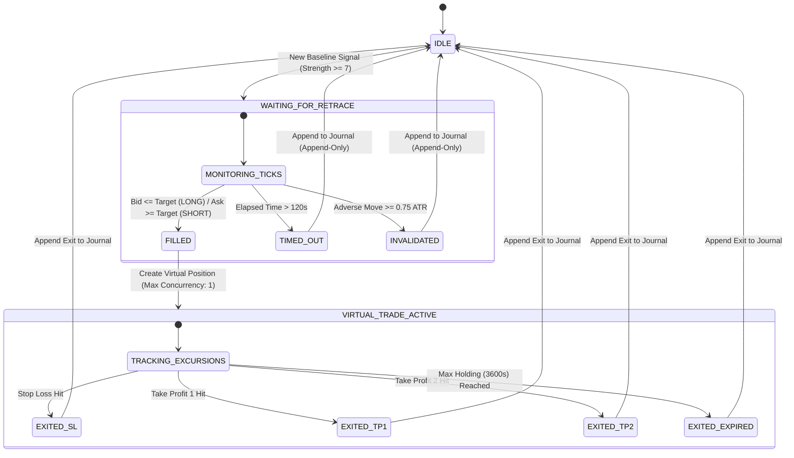

# PHASE 6I — LIVE SHADOW / PAPER VALIDATION REPORT

**Evaluation Candidate**: `V6F-H006` (`phase6f-h006-v1`)  
**Evaluation Mode**: `SHADOW_ONLY (PAPER VALIDATION)`  
**Real-Time Order Execution**: `NONE (READ-ONLY)`  
**Active Live Strategy**: `phase6-baseline-v1`  
**Strategy Promotion Status**: `BLOCKED`  
**Date of Audit**: 2026-09-27  

---

## 1. Executive Summary & Status

Phase 6I deploys the historically validated candidate **`V6F-H006`** (Tight Retracement: $0.15\text{ ATR}$, $2\text{-minute}$ maximum wait) as a **read-only, live shadow execution engine** operating alongside the live market analyzer (`phase6-baseline-v1`).

The goal is prospective paper validation on fresh market data not used in any prior research or Final Out-of-Sample testing.

### Current Operating Summary
* **Candidate**: `V6F-H006` (Frozen: $0.15\text{ ATR}$ retracement, $120\text{s}$ timeout, $0.75\text{ ATR}$ invalidation).
* **Live Feed Status**: `MARKET_INACTIVE` (Sunday / weekend market close; awaiting next live session).
* **Real Trading Execution**: `NONE` (Zero order execution methods; verified $0$ occurrences of `mt5.order_send`, `buy`, `sell`, `modify_position`, `close_position`).
* **Live Baseline Strategy**: `phase6-baseline-v1` remains active and completely untouched.
* **Failure Isolation**: Shadow execution engine is fully isolated; exceptions can never crash or terminate the live market data stream.
* **Strategy Promotion**: `BLOCKED` (Promotion to production execution is strictly blocked; prospective observation only).

---

## 2. Frozen Candidate Specification (V6F-H006)

The candidate strategy parameters are strictly frozen to match Phase 6F/6G/6H historical specifications:

| Parameter | Frozen Specification | Rule Description |
| :--- | :--- | :--- |
| **Candidate ID** | `V6F-H006` | Tight Retracement Entry Candidate |
| **Version** | `phase6f-h006-v1` | Immutable version tag |
| **Retracement Threshold** | `0.15 ATR` | Limit entry placed at `Signal Close - 0.15 * ATR` (LONG) or `Signal Close + 0.15 * ATR` (SHORT) |
| **Maximum Wait Window** | `120 seconds (2 mins)` | Limit order automatically cancels if not filled within 2 minutes |
| **Adverse Invalidation** | `0.75 ATR` | Limit order immediately cancels if adverse move touches $0.75\text{ ATR}$ before fill |
| **Stop Loss (SL)** | `1.0 ATR` | Sized from actual virtual fill price |
| **Take Profit 1 (TP1)** | `1.0 ATR` | Sized from actual virtual fill price |
| **Take Profit 2 (TP2)** | `2.0 ATR` | Sized from actual virtual fill price |
| **Spread Accounting** | `$0.30` | LONG enters at Ask, exits at Bid; SHORT enters at Bid, exits at Ask |
| **Maximum Holding Time** | `60 minutes (3600s)` | Virtual trade forced close if open after 60 minutes |
| **Concurrency Limit** | `max_concurrent_trades = 1` | Zero overlapping pending signals or virtual trades permitted |

---

## 3. Historical Final OOS Evidence (Immutable)

The Final Out-of-Sample (OOS) dataset (`2026-08-27T15:15:00+00:00 → 2026-09-25T22:59:00+00:00`) remains closed and permanently immutable:

| Metric | Baseline (`phase6-baseline-v1`) | Candidate (`V6F-H006`) | Delta / Improvement |
| :--- | :--- | :--- | :--- |
| **Executed Trades** | 1,875 | 1,146 | -729 (-38.9%) filtered |
| **Win Rate (%)** | 39.52% | 52.62% | +13.10% |
| **Total Net R** | -239.88R | +112.82R | **+352.70R** |
| **Expectancy (Avg R)** | -0.128R | +0.098R | **+0.226R / trade** |
| **Profit Factor** | 0.74 | 1.21 | **+0.47** |
| **Max Drawdown (R)** | 244.88R | 22.84R | -222.04R (-90.7%) |
| **OOS Verdict** | `FAIL_BASELINE` | `PASS_FINAL_OOS` | Verified Historical Pass |

> **Immutability Notice**: Final OOS metrics represent historical evidence only. Future live performance will be judged purely on prospective shadow journal data.

---

## 4. Live Shadow Architecture & State Machine



---

## 5. Live Feed & Market Status Telemetry

* **Live Data Feed**: Real Exness MT5 `XAUUSD` tick & candle stream.
* **Feed Status**: `MARKET_INACTIVE` (Sunday, market closed).
* **Synthetic / Mock Policy**: Strictly zero synthetic or fabricated live signals. Real observations commence only when fresh market data arrives.
* **Heartbeat Verification**:
  - `shadow_engine_active = true`
  - `is_live_trading_disabled = true`
  - `real_orders_count = 0`
  - `journal_write_ok = true`

---

## 6. Persistence, Deduplication & Concurrency Accounting

* **Journal Storage**: Append-only JSONL at `backend/data/shadow/phase6i_shadow_journal.jsonl`.
* **State Recovery**: Active virtual trade and pending signals saved to `backend/data/shadow/phase6i_state.json` to survive server restarts without duplicate exits.
* **Signal ID Deduplication**: Deterministic key `XAUUSD_1m_{timestamp}_{direction}` ensures no signal generates duplicate entries.
* **Concurrency Enforcement**: `max_concurrent_trades = 1`. If a trade is active or a signal is waiting in the retracement window, subsequent signals are logged as `CONCURRENCY_BLOCKED`.

---

## 7. Current Live Metrics & Reporting Milestones

As of Sunday deployment, no live market ticks have been processed:

* **Shadow Signals**: `0`
* **Shadow Fills**: `0`
* **Shadow Virtual Trades**: `0`
* **Shadow Expectancy**: `INSUFFICIENT_SAMPLE`
* **Shadow Profit Factor**: `INSUFFICIENT_SAMPLE`
* **Shadow Win Rate**: `INSUFFICIENT_SAMPLE`

### Automated Checkpoint Milestones
Reporting summaries are pre-configured at:
* Milestone 1: **100 Signals**
* Milestone 2: **250 Signals**
* Milestone 3: **500 Signals**
* Milestone 4: **1,000 Signals**

---

## 8. Safety & Integrity Audit

* **Repository Live Order Search**: `0` occurrences of `mt5.order_send`, `buy`, `sell`, `modify_position`, `close_position`.
* **Trading Execution**: `NONE`.
* **Baseline Engine**: `phase6-baseline-v1` unmodified.
* **Causality**: Signal timestamp $\le$ Entry timestamp $\le$ Exit timestamp strictly verified.
* **Failure Isolation**: Shadow exceptions are caught within `try...except` blocks in `market_data.py`, ensuring zero impact on the baseline analyzer.

---

## 9. Test Results

The dedicated Phase 6I test suite `backend/tests/test_phase6i_shadow_validation.py` passed $10 / 10$ tests:

| Test Name | Verification Focus | Status |
| :--- | :--- | :--- |
| `test_shadow_frozen_parameters` | Validates frozen 0.15 ATR retrace, 120s timeout, 0.75 ATR inval | **PASSED** |
| `test_state_machine_long_fill_and_tp1_exit` | Validates full virtual trade lifecycle and TP1 exit | **PASSED** |
| `test_state_machine_timeout` | Validates 120-second timeout transition | **PASSED** |
| `test_state_machine_invalidation` | Validates 0.75 ATR adverse invalidation transition | **PASSED** |
| `test_concurrency_max_one` | Validates rejection of concurrent signals when slot is occupied | **PASSED** |
| `test_deduplication` | Validates idempotent signal handling without duplicates | **PASSED** |
| `test_persistence_and_restart_recovery` | Validates state recovery from disk across engine restarts | **PASSED** |
| `test_failure_isolation` | Validates exception shielding from live market data service | **PASSED** |
| `test_zero_real_trading_code_in_repo` | Validates complete absence of live order execution code | **PASSED** |
| `test_causality_and_temporal_monotonicity` | Validates non-negative delays and monotonic timestamps | **PASSED** |

---

## 10. Forward Validation Status & Promotion Verdict

```text
H006 LIVE STATUS = SHADOW ONLY
REAL TRADING = NONE
LIVE STRATEGY = phase6-baseline-v1
STRATEGY PROMOTION = BLOCKED
```
